# Catfish Movement in Římov Reservoir

> **Graphical Abstract (top)**  
> *Graphic depiction of the expected turning angle (radians) and step length (m) distributions for a three‑state Hidden Markov Model.*  
> *Adapted from Rabaneda‑Bueno (unpublished).*

<p align="center">
  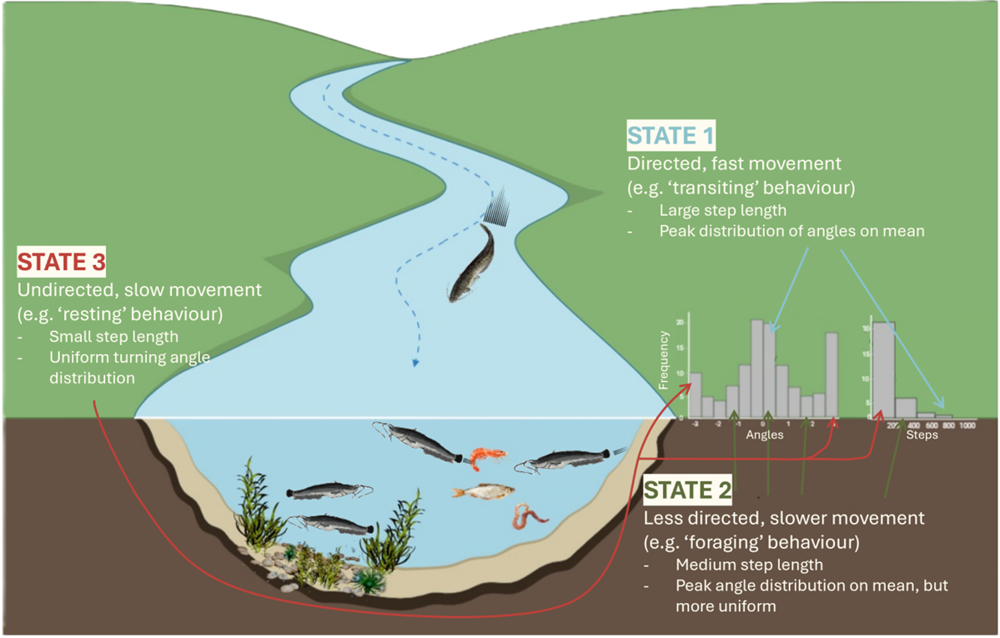
</p>

---

## Table of Contents

- [Overview](#overview)
- [Study Area](#study-area)
- [Data \& Telemetry](#data--telemetry)
- [Environmental Data](#environmental-data)
- [Analysis Workflow (End-to-End)](#analysis-workflow-end-to-end)
  - [0. Environment Setup](#0-environment-setup)
  - [1. Load Libraries \& Helper Functions](#1-load-libraries--helper-functions)
  - [2. Load \& Filter Telemetry Data](#2-load--filter-telemetry-data)
  - [3. Clean \& Prepare Tracks for HMM](#3-clean--prepare-tracks-for-hmm)
  - [4. Build \& Select HMMs](#4-build--select-hmms)
  - [5. Decode States \& Predict Stationary Probabilities](#5-decode-states--predict-stationary-probabilities)
  - [6. Habitat Modeling (CLMMs)](#6-habitat-modeling-clmms)
  - [7. 3D Habitat Use (rKIN)](#7-3d-habitat-use-rkin)
- [Results](#results)
  - [Activity States](#activity-states)
  - [Time Allocation \& Spatial Distribution](#time-allocation--spatial-distribution)
  - [Influence of Temperature \& Time of Day](#influence-of-temperature--time-of-day)
  - [Habitat Use and Diel Period (CLMMs)](#habitat-use-and-diel-period-clmms)
  - [Three-Dimensional Habitat Use](#three-dimensional-habitat-use)
- [Figures](#figures)
- [Tables](#tables)
- [Discussion (brief)](#discussion-brief)
- [Appendix I](#appendix-i)
- [Appendix II](#appendix-ii)

---

## Overview

We analyzed the summer movement behavior of European catfish (*Silurus glanis*) in the Římov Reservoir (Czech Republic) using high-resolution acoustic telemetry and a three-state Hidden Markov Model (HMM). We integrated temperature (epilimnion) and diel cycling, mapped state-specific spatial use, modeled habitat effects with cumulative link mixed models (CLMMs), and visualized 3D habitat overlaps (core vs home-range). The full computational pipeline and figures are embedded below.

[Back to top](#table-of-contents)

---

## Study Area

Římov Reservoir is a canyon-shaped reservoir in South Bohemia, Czech Republic (N 48°51.00978′, E 14°29.47462′), built in 1978 for drinking water and flood control. The main reservoir body extends ~10 km; surface area 210 ha; mean depth ~16 m (max 45 m). A longitudinal gradient exists from mesotrophic conditions at the dam to eutrophic conditions toward the main inflow (Šeda & Devetter, 2000), with parallel gradients in algae, zooplankton, and fish density. The system typically stratifies from April–September (Říha et al., 2022). Due to fluctuating water levels and steep banks, submerged aquatic macrophytes are typically absent in the littoral zone (Říha et al., 2015).

Public access is restricted, with an estimated ~200 catfish and minimal angling disturbance, making the system well-suited for studying natural movement in a lentic environment. During the study period (July–August 2017), epilimnion temperatures ranged 19.7–22.7 °C (mean 21 ± 0.6 °C). Thermocline depth averaged 5.47 m.

[Back to top](#table-of-contents)

---

## Data & Telemetry

An array of 91 acoustic receivers (Lotek WHS3250) was deployed on 2017‑04‑18 to cover the entire reservoir (87), the inflowing tributary (3), and one small bay near the dam (1). This design allowed fine‑scale high-resolution positions (see Figure 1). Temperature stratification was monitored using HOBO Pendant temp/light 64K loggers at four longitudinal locations (loggers placed every 1 m from surface to 13 m; plus 20 m at dam and mid sections). For analysis, we used the mean 0–6 m temperature (epilimnion).

Fifteen *S. glanis* were captured by long‑lining (per Vejřík et al., 2017) at four reservoir locations (2017‑04‑18 to 2017‑04‑25), anesthetized with 2‑phenoxy‑ethanol (0.7 ml l⁻¹), surgically implanted with Lotek MM‑M‑11‑28‑TP transmitters (65×12 mm, 13 g; burst 15 s; plus pressure/temperature sensors), and released at capture sites. Locations were post‑processed with UMAP v1.4.3 (Lotek); data cleaning follows Říha et al. (2021, 2022). For this study, we used 2017‑07‑01 to 2017‑08‑31 (peak activity/growth; Copp et al., 2009). After filtering, 13 individuals and 85,650 positions remained.

[Back to top](#table-of-contents)

---

## Environmental Data

- Epilimnion temperatures: mean of 0–6 m across four stations.  
- Diurnal/cyclic time derived from timestamps (UTC) via trigonometric transforms.  
- Thermocline depth for 3D visualization context.

[Back to top](#table-of-contents)

---

## Analysis Workflow (End-to-End)

> **Tip:** Each section below includes the exact code used in the analysis. You can copy/paste or run directly as scripts in your project structure.

### 0. Environment Setup

- **Project structure**
```
.
├─ data/
│  ├─ pos_mean2.csv
│  ├─ mean_temp_6m.csv
│  ├─ wels_raw_large_tracks_crawl.df.csv
│  ├─ detection_depth.csv
│  ├─ dist2shore_calc.csv
│  ├─ rimov_thermo.csv
│  ├─ shp_files/            # reservoir polygon shapefile
│  └─ final_model_output_data/
├─ scripts/
│  ├─ libraries.R
│  ├─ functions.R
│  ├─ data_load.R
│  ├─ data_clean.R
│  ├─ hmm_function.R
│  ├─ hmm_wels_data_clean.R
│  ├─ HMM_wels_FINAL_copy.R
│  ├─ CLMM_final_updated.R
│  └─ botDepth_depth_rKIN_visual_updated.R
└─ figures/
   ├─ Figure_1.png
   ├─ Figure_5.png
   ├─ Figure_7.png
   ├─ Figure_9.png
   ├─ Figure_11.png
   ├─ Figure_12.png
   ├─ Figure_13.png
   ├─ Table 1.png
   ├─ Figure_A1.1.png
   ├─ Figure_A1.2.png
   └─ graphical_abstract.png
```

[Back to top](#table-of-contents)

---

### 1. Load Libraries & Helper Functions

**`scripts/libraries.R`**
```r
# installing libraries (load)
library(lubridate)
library(tidyverse)
library(data.table)
library(ggplot2)
library(crawl)
library(sf)
library(moveHMM)
library(performance)
library(ggpubr)
library(sjPlot)
library(circular)  # For von Mises density
```

**`scripts/functions.R`**
```r
# Compute swimming distance (2D/3D) and temporal diffs
comp.dist <- function (easting, northing, depth, timestamp){
  diff.time  <- c(NA, diff(as.numeric(timestamp), lag = 1))
  diff.east  <- c(NA, diff(easting,  lag = 1))
  diff.north <- c(NA, diff(northing, lag = 1))
  diff.depth <- c(NA, diff(depth,    lag = 1))
  swim.dist2D <- sqrt(diff.east^2 + diff.north^2)
  swim.dist3D <- sqrt(swim.dist2D^2 + diff.depth^2)
  return(list(diff_depth = diff.depth,
              diff_time  = diff.time,
              swim_dist_2D = swim.dist2D,
              swim_dist_3D = swim.dist3D))
}
```

[Back to top](#table-of-contents)

---

### 2. Load & Filter Telemetry Data

**`scripts/data_load.R`** (load data and reservoir polygon; verify CRS; filter to reservoir)
```r
source("./scripts/libraries.R")

pos_mean <- read_csv("./data/pos_mean2.csv")
rimov_pol <- st_read("./data/shp_files")

# Convert fish positions to sf points; set CRS to UTM 33N (EPSG:32633)
pos_mean_sf <- st_as_sf(pos_mean, coords = c("easting", "northing")) %>% 
  st_set_crs(32633)

# Remove positions outside reservoir polygon (GPS/detection errors)
inside_test <- st_intersects(pos_mean_sf, rimov_pol, sparse = TRUE)
pos_mean_sf$within_poly <- apply(inside_test, 1, any)

# Keep only positions within polygon, restore coordinates to columns
pos_mean_filter_sf <- pos_mean_sf %>% filter(within_poly)
pos_mean_filter <- as.data.frame(st_coordinates(pos_mean_filter_sf$geometry))
pos_mean_filter <- cbind(pos_mean_filter_sf[,-c(1)], pos_mean_filter)
colnames(pos_mean_filter)[1] <- "fishid"

pos_mean_filter <- pos_mean_filter %>%
  arrange(fishid, timestamp_5min) %>% 
  filter(within_poly)

# Export filtered positions
write_csv(pos_mean_filter, "./data/pos_mean_wels_filter.csv")

# Quick visualization
plot(st_geometry(rimov_pol), axes = TRUE, ylim = c(5407000, 5408000)) 
plot(st_geometry(pos_mean_sf), add = TRUE, pch=19, col="red")
plot(st_geometry(pos_mean_filter_sf), add = TRUE, pch=19, col="lightblue")
```

> **Note:** `scripts/data_clean.R` duplicated the above logic; keep one canonical version (`data_load.R`).

[Back to top](#table-of-contents)

---

### 3. Clean & Prepare Tracks for HMM

- Regularize tracks with CTCRW (via `crawlWrap` in `momentuHMM`), interpolate gaps ≤ 1.5 h, split longer gaps into new tracks.  
- Convert to `moveHMM` format, compute step lengths and turning angles, remove unrealistic steps (> 200 m).

**`scripts/hmm_wels_data_clean.R`**
```r
source("./scripts/libraries.R")

# Read CTCRW-regularized tracks (produced via momentuHMM::crawlWrap upstream)
HMM <- read_csv("./data/wels_raw_large_tracks_crawl.df.csv")
HMM$ID <- as.factor(HMM$ID)

# Convert to moveHMM format
HMM_wels <- moveHMM::prepData(HMM, type = "UTM", coordNames = c("x","y"))

# Inspect & remove very large steps (> 200 m)
HMM_wels$week <- week(HMM_wels$time)
step_length <- 200

HMM_wels_clean <- HMM_wels %>%
  filter(step < step_length)

# Drop temporary columns so object can be reused cleanly elsewhere
HMM_wels_clean <- HMM_wels_clean[ , -c(2:3)]
stopifnot(!any(is.na(HMM_wels_clean)))

write_csv(HMM_wels_clean, "./data/HMM_wels_clean.csv")
```

[Back to top](#table-of-contents)

---

### 4. Build & Select HMMs

We fit a 3‑state HMM using gamma step lengths and von Mises turning angles. Covariates: cyclic time (cos, sin) and standardized epilimnion temperature. We compare models with no covariates, temperature only, time only, additive (time + temp), and interaction (time * temp) using AIC/log‑likelihood. We run multiple initializations to ensure convergence (global optimum).

**`scripts/hmm_function.R`** (randomized starting values; 3‑state)
```r
# Create randomized starting values for 3-state HMM (niter tries)
niter <- 5
allPar0_3s <- lapply(as.list(1:niter), function(x) {
  stepMean0 <- runif(3, min=c(3,25,55), max=c(50,75,100))
  stepSD0   <- runif(3, min=c(3,25,55), max=c(50,75,100))
  angleMean0 <- c(0, pi, pi/2)
  angleCon0  <- runif(3, min=c(1,2,4), max=c(3,5,6))
  list(step = c(stepMean0, stepSD0),
       angle = c(angleMean0, angleCon0))
})
```

**`scripts/HMM_wels_FINAL_copy.R`** (model fitting, selection, decoding, and probability prediction)
```r
source("./scripts/hmm_function.R")
source("./scripts/libraries.R")

# Load tracks (CTCRW-regularized)
HMM <- read_csv("./data/wels_raw_large_tracks_crawl.df.csv")
HMM$week <- week(HMM$time)

# Time-of-day (hours + seconds), cyclic transforms
HMM <- HMM %>% mutate(day_time = hour(time) + minute(time)/60)
HMM2 <- HMM %>% mutate(hour = hour(time), minute = minute(time), sec = second(time),
                       day_time_sec = hour*3600 + minute*60 + sec,
                       cos_time = cos(2*pi*day_time_sec/86400),
                       sin_time = sin(2*pi*day_time_sec/86400))

# Classify diel period two ways; use sun-based classification for filtering
library(suncalc)
getNightDay <- function(x, lat=48.8497428, lon=14.4903039, xtz="UTC",
                        returnSunrSuns=FALSE, day="day", night="night") {
  if (length(x)==0) stop("length of input is 0")
  if (all(is.na(x))) return(as.character(x))
  library(data.table); library(suncalc)
  x <- as.POSIXct(x, tz=xtz)
  from_date <- as.Date(min(x, na.rm=TRUE), tz=xtz) - 1
  to_date   <- as.Date(max(x, na.rm=TRUE), tz=xtz) + 1
  day_seq   <- seq.Date(from_date, to_date, by="day")
  sunTimes  <- data.table::as.data.table(getSunlightTimes(date=day_seq, lat=lat, lon=lon, tz=xtz))
  sunrise_col <- if ("sunrise" %in% names(sunTimes)) "sunrise" else "sunriseTime"
  sunset_col  <- if ("sunset"  %in% names(sunTimes)) "sunset"  else "sunsetTime"
  sunTimes[, Date := as.Date(date, tz=xtz)]
  sunTimes_subset <- sunTimes[, .(Date, sunrise=get(sunrise_col), sunset=get(sunset_col))]
  dt <- data.table(x=x, xorder=seq_along(x), Date=as.Date(x, tz=xtz))
  dt <- merge(dt, sunTimes_subset, by="Date", all.x=TRUE)
  dt[, Diel.period := ifelse(x > sunrise & x < sunset, day, night)]
  setorder(dt, xorder)
  if (returnSunrSuns) dt[, .(Diel.period, sunrise, sunset)] else dt$Diel.period
}

HMM2 <- data.table(HMM2)
HMM2[, dp := getNightDay(time)]

# Filter weeks with >=100 obs per diel period per day
HMM_counts <- HMM2 %>% group_by(ID, week, dp) %>% tally() %>% spread(dp, n)
HMM2_full <- left_join(as_tibble(HMM2), HMM_counts, by=c("ID","week"))
HMM2_full$ncount_day[is.na(HMM2_full$ncount_day)]   <- 0
HMM2_full$ncount_night[is.na(HMM2_full$ncount_night)] <- 0
HMM2_filt <- HMM2_full %>% group_by(ID, week) %>% filter(ncount_day>=100 & ncount_night>=100)

# Prepare for HMM & remove steps > 200 m and NA angles
HMM_prep <- moveHMM::prepData(HMM2_filt, type="UTM", coordNames=c("x","y"))
HMM_prep <- HMM_prep %>% filter(step < 200) %>% drop_na(angle)

# Epilimnion temperature (merge + standardize)
epi_mean_temp <- read_csv("./data/mean_temp_6m.csv") %>%
  rename(time = hd_timestamp_utc) %>%
  filter(time > "2017-07-01 UTC", time < "2017-09-01 UTC")

HMM_merged <- left_join(HMM2_filt, epi_mean_temp, by="time")
mu <- mean(HMM_merged$temp_mean, na.rm=TRUE)
sigma <- sd(HMM_merged$temp_mean, na.rm=TRUE)
HMM_merged <- HMM_merged %>% filter(!is.na(temp_mean)) %>%
  mutate(stand_mean_temp = (temp_mean - mu)/sigma)

HMM_prep2 <- moveHMM::prepData(HMM_merged, type="UTM", coordNames=c("x","y")) %>%
  filter(step < 200) %>% drop_na(angle)

# Initial parameters (3 states)
stepMean_3s <- c(3, 15, 50); stepSD0_3s <- c(3, 15, 50)
angleMean_3s <- c(pi, 0, pi/2); angleCon0_3s <- c(1, 2, 5)
stepPar0_3s <- c(stepMean_3s, stepSD0_3s)
anglePar0_3s <- c(angleMean_3s, angleCon0_3s)

# Fit candidate models
HMM_nocovars <- moveHMM::fitHMM(HMM_prep2, nbStates=3, stepPar0=stepPar0_3s, anglePar0=anglePar0_3s)
HMM_time     <- moveHMM::fitHMM(HMM_prep2, nbStates=3, stepPar0=stepPar0_3s, anglePar0=anglePar0_3s,
                                formula=~cos_time + sin_time)
HMM_temp     <- moveHMM::fitHMM(HMM_prep2, nbStates=3, stepPar0=stepPar0_3s, anglePar0=anglePar0_3s,
                                formula=~stand_mean_temp)
HMM_add      <- moveHMM::fitHMM(HMM_prep2, nbStates=3, stepPar0=stepPar0_3s, anglePar0=anglePar0_3s,
                                formula=~cos_time + sin_time + stand_mean_temp)
HMM_inter    <- moveHMM::fitHMM(HMM_prep2, nbStates=3, stepPar0=stepPar0_3s, anglePar0=anglePar0_3s,
                                formula=~(cos_time + sin_time)*stand_mean_temp)

# Model selection
AIC(HMM_inter, HMM_add, HMM_temp, HMM_nocovars, HMM_time)

# Decode most likely state sequence & stationary probabilities using best model (interaction)
best_fit <- HMM_inter
decoded_states <- factor(moveHMM::viterbi(best_fit))
state_probs <- stationary(best_fit, covs = HMM_prep2 %>% dplyr::select(sin_time, cos_time, stand_mean_temp) %>% as.data.frame())
colnames(state_probs) <- c("prob_s1","prob_s2","prob_s3")

# Attach to dataset and export
HMM_out <- cbind(HMM_prep2, state_probs)
HMM_out$state_3s <- decoded_states
write_csv(HMM_out, "./data/final_model_output_data/HMM_final_output_TimeTempInt_UPDATED.csv")
```

[Back to top](#table-of-contents)

---

### 5. Decode States & Predict Stationary Probabilities

- Label states by movement characteristics:  
  - State 1: **Inactivity** (short steps, large turning angles)  
  - State 2: **High activity** (long steps, small turning angles)  
  - State 3: **Low activity** (medium steps, small turning angles)

- Predict stationary state probabilities across 24 h at low/mean/high epilimnion temperature scenarios.

**(excerpt from `scripts/HMM_wels_FINAL_copy.R`, visualization)**  
```r
# Build step length & turning angle distributions (Gamma, von Mises), and plot histograms + fits
# ... (plots created as in your script)

# Stationary state probabilities under low / mean / high epilimnion temperatures
# covariate frames (cos_time, sin_time, stand_mean_temp) created and fed into stationary()
# ... (gg_lowT2, gg_avgT2, gg_highT2; combined via ggarrange)
```

[Back to top](#table-of-contents)

---

### 6. Habitat Modeling (CLMMs)

We used proportional-odds CLMMs (`ordinal::clmm` and `clmm2`) with ordered response **Inactive < Low_active < High_active**, random intercept for fish ID, and separate models per habitat variable (distance to shore, bottom depth, distance to bottom, fish depth). Diel period was an effect modifier (interaction) given diel cycle already informs HMM state dynamics.

**`scripts/CLMM_final_updated.R`**
```r
source("./scripts/libraries.R")
library(ordinal); library(corrr); library(car)

wels_data   <- read_csv("./data/final_model_output_data/HMM_final_output_TimeTempInt_UPDATED.csv")
detection_depth <- read_csv("./data/detection_depth.csv")
bot_depth   <- read_csv("./data/pos_mean_wels_filter.csv") %>%
  rename(ID = fishid, time = timestamp_5min) %>% select(-depth)
dist2shore  <- read_csv("./data/dist2shore_calc.csv") %>% select(ID, time, dist_calc)

# Merge covariates
wels_clmm_dat <- wels_data %>%
  left_join(detection_depth, by=c("ID","time")) %>%
  left_join(bot_depth,       by=c("ID","time")) %>%
  left_join(dist2shore,      by=c("ID","time")) %>%
  select(ID, time, dp, state_3s, depth, bottom_depth, dist_calc, day_time) %>%
  rename(diel_period = dp)

# Interpolate missing depth/bottom depth (≤45 min gaps), compute distance to bottom
# (helper function interpolate_column defined; see provided code)
# ... (interpolation + mutates → dist2bot)

# Recode activity and set ordered factor
clmm_full <- as.data.table(wels_clmm_dat)  # after interpolation + dist2bot steps
# activity_state: Inactive < Low_active < High_active
# Fit CLMMs for H1–H4 with interaction to diel_period + random ID
# Visualization via clmm2 for predicted probabilities by day/night
# ... (H1_fig, H2_fig, H3_fig, H4_fig; combined into a single figure)
```

[Back to top](#table-of-contents)

---

### 7. 3D Habitat Use (rKIN)

We estimated kernel isopleths (50% core, 95% home range) for each state **by diel period** in the **bottom‑depth × fish‑depth** plane and computed polygon overlaps. We also derived maximum spatial extents.

**`scripts/botDepth_depth_rKIN_visual_updated.R`**
```r
library(rKIN); library(sf); library(ggpubr)

rim <- read_csv("./data/final_model_output_data/HMM_final_output_TimeTempInt_UPDATED.csv") %>%
       select(ID, step, angle, x, y, time, dp, state_3s)

bot_depth <- read_csv("./data/pos_mean_wels_filter.csv") %>%
             rename(ID = fishid, time = timestamp_5min)

rim_depth <- left_join(rim, bot_depth, by=c("ID","time"))

# Interpolate missing depth/bottom depth (≤45 min), compute dist2bot
# Create day vs night data frames; flip fish depth sign for plotting (downwards)
# estKIN(..., levels=c(50,95)); getArea(); calcOverlap()
# Build overlap tables for 50% and 95%; summarize max extents by state × diel
# Plot day/night core & home range panels plus thermocline line
# ... (final combined figure and summary table exported/shown)
```

[Back to top](#table-of-contents)

---

## Results

### Activity States

Three distinct movement states emerged:  
- **High activity:** long steps (mean ≈ 72.1 ± 29.5 m) and small turning angles (mean ≈ 0.005 rad; κ ≈ 1.7).  
- **Low activity:** medium steps (21.3 ± 15.3 m) and small turning angles (−0.005 rad; κ ≈ 0.6).  
- **Inactivity:** short steps (2.4 ± 2.2 m) and large turning angles (−3.14 rad; κ ≈ 0.2).  

Areas differed significantly by state (p < 0.001), increasing with activity (mean [ha]: 8.03 ± 1.40, 37.78 ± 4.63, 74.52 ± 9.06). Higher‑activity areas largely encompassed lower‑activity areas.

### Time Allocation & Spatial Distribution

Time in state varied among individuals (see Figure_9). Most fish (9/13) spent ~30–48% inactive; fish with fewer observations (< ~3000) showed lower inactivity percentages but still had concentrated inactivity areas. Inactivity locations varied among individuals, often with multiple hotspots per fish.

### Influence of Temperature & Time of Day

At mean epilimnion temperature (21 °C), high activity probability peaked around sunset to night (~16:30–01:30), while inactivity peaked during day (~02:00–15:30), with low activity in transitional periods. Warmer water (22.7 °C) delayed transitions by ~1–1.5 h and increased high activity; cooler water (19.7 °C) advanced transitions by ~1.5–3 h and reduced high‑activity probability.

### Habitat Use and Diel Period (CLMMs)

CLMMs indicated activity increased offshore and in deeper habitats, with diel period strongly elevating activity at night, albeit with weaker marginal effects at night (interactions < 1). Low ICC (0.06–0.10) suggests most variation occurred **within** individuals (i.e., consistent relationships across fish). Odds ratios:  
- **Distance to shore:** OR ≈ 6.08 (95% CI: 5.90–6.27); interaction (night) OR ≈ 0.44.  
- **Bottom depth:** OR ≈ 6.19 (6.00–6.39); interaction OR ≈ 0.42.  
- **Distance to bottom:** OR ≈ 5.24 (5.07–5.41); interaction OR ≈ 0.45.  
- **Fish depth:** OR ≈ 1.39 (1.38–1.41); weakest model fit/highest AIC.

### Three-Dimensional Habitat Use

**Daytime (core 50%):** Inactivity concentrated near shore and shallow (max fish depth 4.1 m; max reservoir depth 5.9 m). High activity spanned nearshore to deepest areas (MRD up to 34.9 m), often occupying deeper portions of the water column in shallower zones. Low activity occurred at intermediate distances (MRD 15.9 m) and slightly deeper water column positions than high activity (MFD 8.9 m). Overlap was moderate between inactivity and high activity (~50.9%); low fully overlapped inactivity (100%).  
**Daytime (home 95%):** Similar habitats but broader extents; high activity overlapped widely with other states nearshore and extended to deepest areas (MRD 36.9 m).  
**Nighttime:** Patterns broadly similar but fish occupied shallower depths across states. Notably, inactivity home range extended into much deeper habitats at night (MRD 27.9 m) while remaining nearshore; max fish depths decreased at night across states.

[Back to top](#table-of-contents)

---

## Figures

> All images should be placed in your repo at `figures/`. If your filenames differ, update the links below.

**Figure_1. Receiver array and bathymetry.**  
*Placement of telemetry receivers in Římov Reservoir, Czech Republic. Blue shading shows bathymetry. Adapted from Říha et al. 2025a.*  
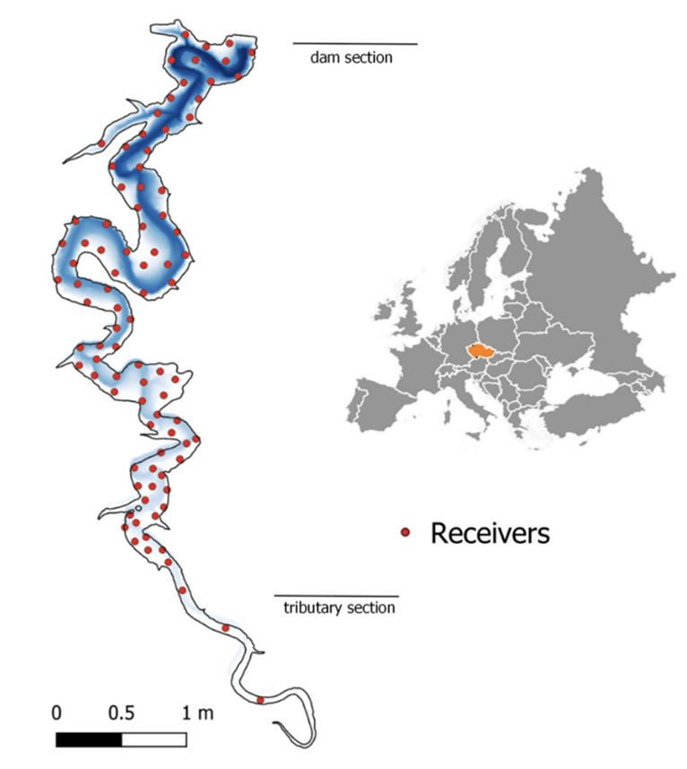

**Figure_5. State-dependent movement distributions.**  
*Final HMM model: (a) step length and (b) turning angle distributions by state (Gamma and von Mises fits overlaid).*  
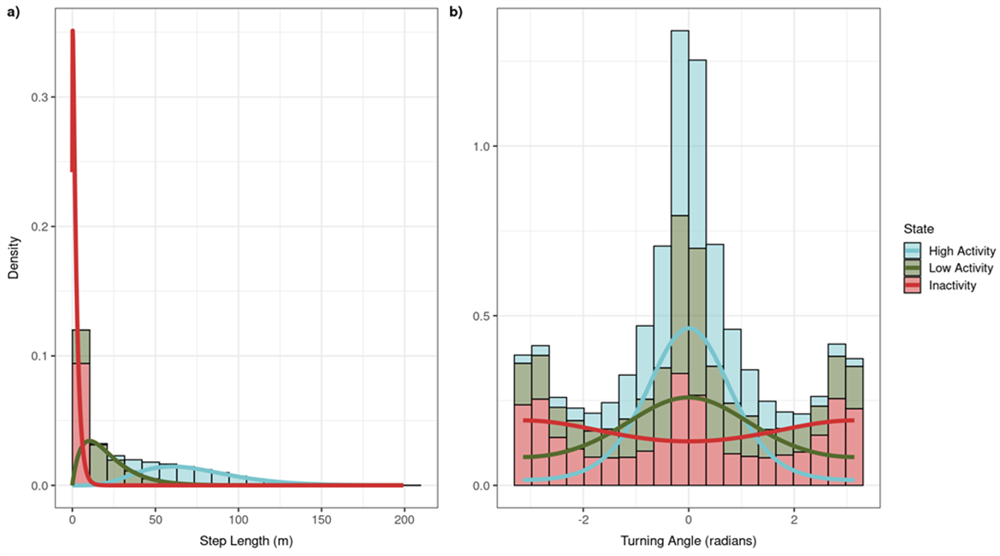

**Figure_7. Total utilized horizontal area by state (N = 13).**  
*Logged area differs among states; mean increases with activity. An asterisk (*) denotes significance (ANOVA, p < 0.001).*  
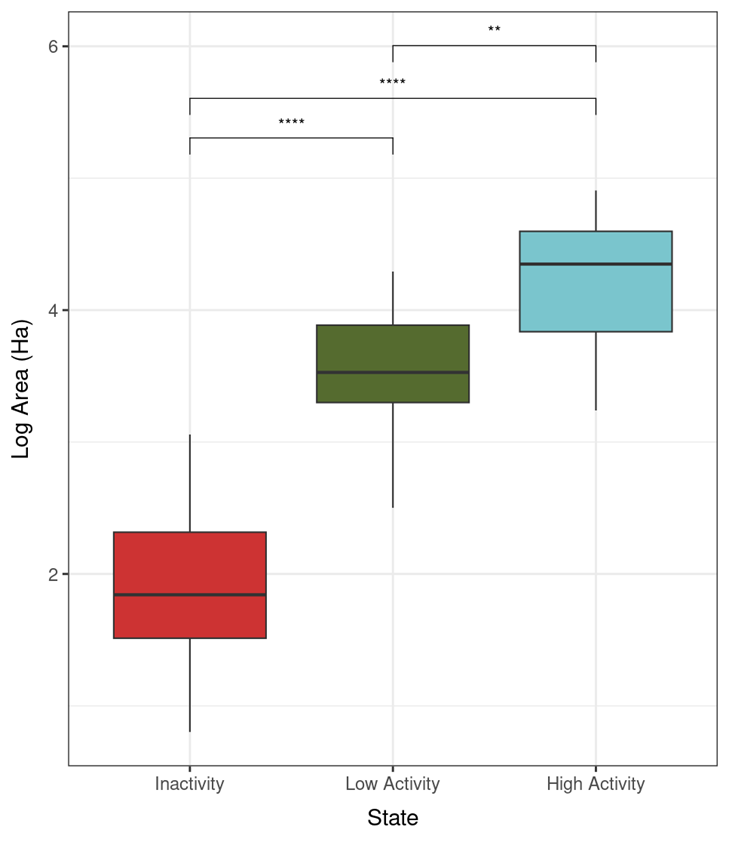

**Figure_9. Individual state allocations.**  
*Proportion of detections per state for each fish; total detections per individual shown above bars.*  
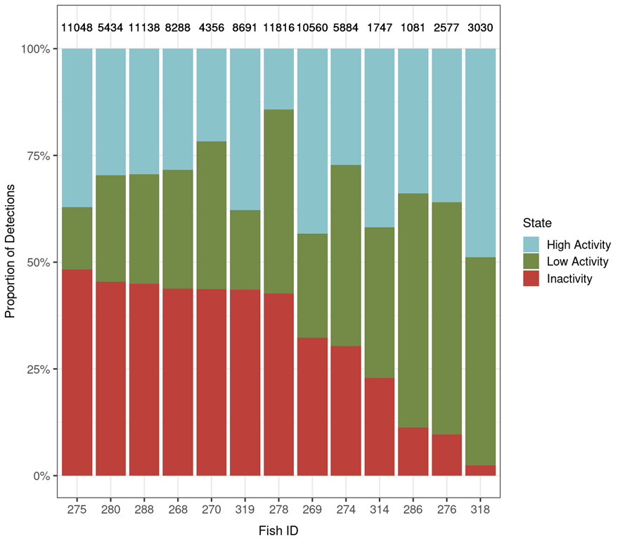

**Figure_11. Diurnal state probabilities under temperature scenarios.**  
*Probability of being in each state per hour under (a) low (19.7 °C), (b) mean (21 °C), and (c) high (22.7 °C) epilimnion temperatures. Dark grey: civil twilight; light grey: sunrise/sunset windows (UTC; July–August 2017; Č. Budějovice).*  
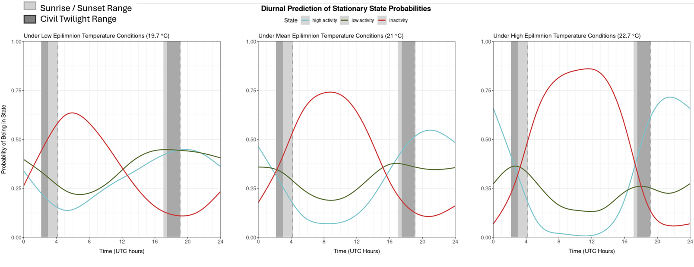

**Figure_12. Habitat effects on state probabilities by diel period.**  
*Change in state probabilities as a function of (a) distance from shore, (b) reservoir bottom depth, (c) distance to bottom, and (d) fish depth. Solid = day; dotted = night.*  
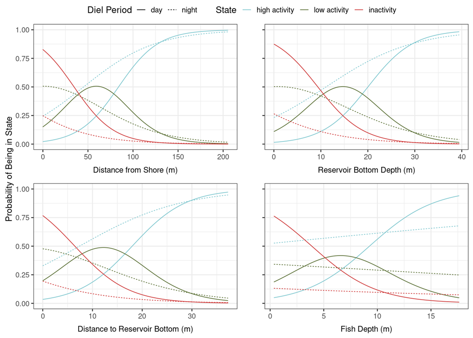

**Figure_13. 3D state overlap (depth × bottom depth).**  
*Spatial overlay of (a,c) core (50%) and (b,d) home range (95%) areas by state for day (top) and night (bottom). Dashed black line = mean thermocline; grey wedge = reservoir littoral edge.*  
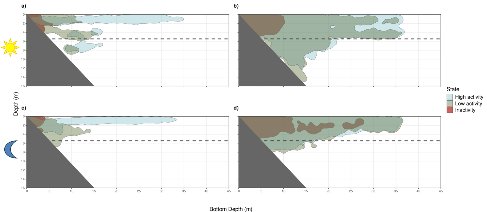

**Appendix Figures**  
*Figure_A1.1.* *Hourly mean epilimnion temperature across study period; red dashed line = global average.*  
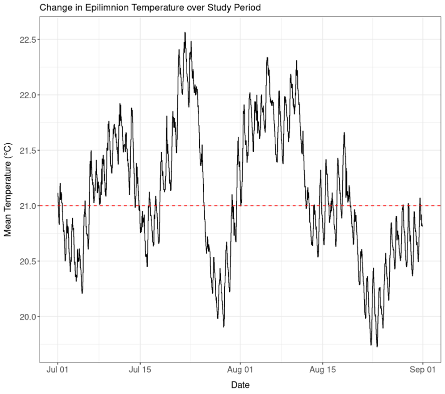

*Figure_A1.2.* *Diurnal change in mean epilimnion temperature by month. Dark grey = civil twilight; light grey = sunrise/sunset (UTC; July–August).*  
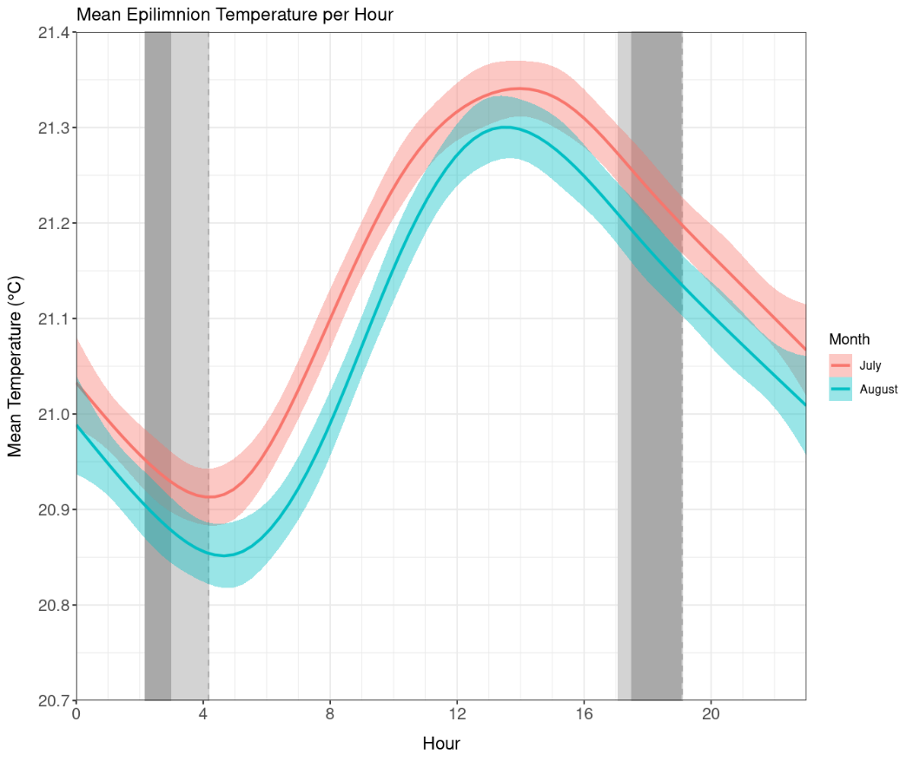

[Back to top](#table-of-contents)

---

## Tables

> Where provided as images, we link them; where data were provided, we render Markdown tables.

**Table 1.** *(as image)*  
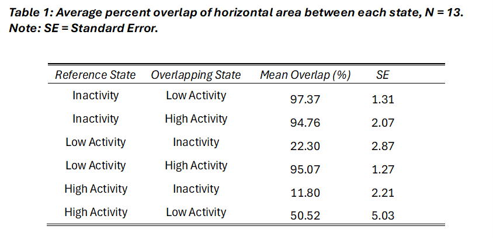

**Table 3. CLMM results**

(a) **Distance to shore model**
| Response Variable | Predictors                          | Odds Ratio | 95% CI        | p-Value |
|---|---|---:|---|---:|
| Activity State    | Inactive \| Low Active              | 0.86       | 0.63–1.18     | 0.348   |
|                   | Low Active \| High Active           | 7.89       | 5.77–10.77    | <0.001  |
|                   | diel period \[night]                | 6.72       | 6.50–6.94     | <0.001  |
|                   | dist calc scaled                    | 6.08       | 5.90–6.27     | <0.001  |
|                   | dist calc scaled × diel \[night]    | 0.44       | 0.43–0.46     | <0.001  |

*Additional:* ICC = 0.09; N = 13; observations = 80,656; conditional Hessian = 967.5; Marginal/Conditional R² = 0.504/0.549; AIC = 122,374.

(b) **Reservoir bottom depth model**
| Response Variable | Predictors                          | Odds Ratio | 95% CI        | p-Value |
|---|---|---:|---|---:|
| Activity State    | Inactive \| Low Active              | 0.91       | 0.70–1.19     | 0.505   |
|                   | Low Active \| High Active           | 8.38       | 6.44–10.89    | <0.001  |
|                   | diel period \[night]                | 7.28       | 7.04–7.53     | <0.001  |
|                   | botdepth scaled                     | 6.19       | 6.00–6.39     | <0.001  |
|                   | botdepth scaled × diel \[night]     | 0.42       | 0.40–0.43     | <0.001  |

*Additional:* ICC = 0.06; N = 13; observations = 80,074; conditional Hessian = 861.7; Marginal/Conditional R² = 0.511/0.543; AIC = 121,465.

(c) **Distance to bottom model**
| Response Variable | Predictors                          | Odds Ratio | 95% CI        | p-Value |
|---|---|---:|---|---:|
| Activity State    | Inactive \| Low Active              | 0.70       | 0.50–0.98     | 0.036   |
|                   | Low Active \| High Active           | 5.93       | 4.25–8.27     | <0.001  |
|                   | diel period \[night]                | 6.53       | 6.31–6.76     | <0.001  |
|                   | dist2bot scaled                     | 5.24       | 5.07–5.41     | <0.001  |
|                   | dist2bot scaled × diel \[night]     | 0.45       | 0.44–0.47     | <0.001  |

*Additional:* ICC = 0.10; N = 13; observations = 70,853; conditional Hessian = 1200.9; Marginal/Conditional R² = 0.453/0.509; AIC = 113,417.

(d) **Fish depth model**
| Response Variable | Predictors                          | Odds Ratio | 95% CI        | p-Value |
|---|---|---:|---|---:|
| Activity State    | Inactive \| Low Active              | 3.63       | 2.85–4.61     | <0.001  |
|                   | Low Active \| High Active           | 21.51      | 16.91–27.36   | <0.001  |
|                   | diel period \[night]                | 23.61      | 22.46–24.82   | <0.001  |
|                   | fish depth                          | 1.39       | 1.38–1.41     | <0.001  |
|                   | fish depth × diel \[night]          | 0.74       | 0.73–0.76     | <0.001  |

*Additional:* ICC = 0.06; N = 13; observations = 80,654; conditional Hessian = 2728.9; Marginal/Conditional R² = 0.334/0.371; AIC = 142,367.

**Table 4. Maximum spatial extent by state, CI, and diel period**

| State        | CI | Diel | Max Fish Depth (m) | Max Reservoir Depth (m) |
|---|---:|---|---:|---:|
| Inactivity   | 50 | Day   | 4.05 | 5.92 |
| Inactivity   | 50 | Night | 3.64 | 4.20 |
| Inactivity   | 95 | Day   | 5.16 |10.35 |
| Inactivity   | 95 | Night | 5.09 |27.93 |
| Low Activity | 50 | Day   | 8.94 |15.92 |
| Low Activity | 50 | Night | 6.81 |14.36 |
| Low Activity | 95 | Day   |15.08 |36.30 |
| Low Activity | 95 | Night | 8.30 |36.60 |
| High Activity| 50 | Day   | 8.53 |34.92 |
| High Activity| 50 | Night | 4.11 |33.47 |
| High Activity| 95 | Day   |12.33 |36.91 |
| High Activity| 95 | Night | 7.51 |36.42 |

**Table 5. Percent overlap of 3D areas between states**

(a) **Core (50% CI)**
| Reference State | Overlapping State | Day Period | Night Period |
|---|---|---:|---:|
| Inactivity | High Activity | 50.9 | 58.3 |
| Inactivity | Low Activity  | 100.0 | 83.2 |
| High Activity | Inactivity | 7.1 | 9.4 |
| High Activity | Low Activity | 32.7 | 30.8 |
| Low Activity | Inactivity | 19.7 | 17.8 |
| Low Activity | High Activity | 46.0 | 40.8 |

(b) **Home Range (95% CI)**
| Reference State | Overlapping State | Day Period | Night Period |
|---|---|---:|---:|
| Inactivity | High Activity | 79.4 | 91.2 |
| Inactivity | Low Activity  | 97.8 | 94.6 |
| High Activity | Inactivity | 15.8 | 37.2 |
| High Activity | Low Activity | 83.4 | 92.8 |
| Low Activity | Inactivity | 20.5 | 38.7 |
| Low Activity | High Activity | 88.1 | 93.0 |

[Back to top](#table-of-contents)

---

## Discussion (brief)

Catfish exhibited strong diel rhythms with elevated nocturnal activity and spatial expansions toward deeper, offshore habitats. Temperature subtly shifted the timing and magnitude of activity, extending nocturnal activity under warmer epilimnion conditions. Habitat associations were consistent across individuals (low ICC), implying similar behavioral rules: inactivity near shallow nearshore habitats by day; increasing activity with distance from shore and bottom depth; and broader 3D overlap at night. These patterns align with foraging in pelagic zones and refuge/rest in littoral areas.

[Back to top](#table-of-contents)

---

## Appendix I

**Table A1.1.** Initial parameters used for HMMs (based on exploratory histograms).

| Parameter | State 1 | State 2 | State 3 |
|---|---:|---:|---:|
| Step Mean | 3 | 25 | 75 |
| Step SD   | 3 | 25 | 75 |
| Step Zero Mass | 0.01 |  | 0.001 |
| Turning Angle Mean | π | 0 | π/2 |
| Turning Angle Precision | 1 | 2 | 25 |

**Table A1.2.** HMM model selection table (AIC, log‑likelihood). Best model includes interaction between cyclic time and temperature.

| Model | AIC | LL |
|---|---:|---:|
| No covariates | 916,760.1 | −458,459.0 |
| Stand_mean_temp | 916,760.1 | −458,354.0 |
| Cos_time + Sin_time | 915,754.3 | −457,845.1 |
| Cos_time + Sin_time + stand_mean_temp | 915,582.3 | −457,753.2 |
| (Cos_time + Sin_time) * stand_mean_temp | **915,517.2** | **−457,708.6** |

**Table A1.3.** CLMM model selection tables (per habitat covariate). Best models included an interaction with diel period. *(summary; see `CLMM_final_updated.R` for full outputs and AICs).*

**Figures A1.1–A1.2** (see [Figures](#figures)).

[Back to top](#table-of-contents)

---

## Appendix II

**Figure_A2.1.** Overall distribution of states across Římov for each catfish after position‑consistency filtering. *(Provide as an additional figure if available; otherwise, this serves as a placeholder caption.)*

[Back to top](#table-of-contents)

---

### Reproducibility Notes

- HMM assumptions: evenly spaced observations enforced via CTCRW interpolation for ≤ 1.5 h gaps; new tracks started for longer gaps. Gamma (step length) and von Mises (angle) distributions used. Multiple initializations ensure convergence robustness.
- CLMMs: checked for proportional odds, collinearity, random‑effects normality, and convergence. Autocorrelation wasn’t modeled explicitly (package limitation), but random effects partially absorb within‑individual dependence.
- All figures correspond to code in `HMM_wels_FINAL_copy.R`, `CLMM_final_updated.R`, and `botDepth_depth_rKIN_visual_updated.R`.

---

## Selected References

- Albeke, S. E. (2025). *rKIN: (Kernel) Isotope Niche Estimation* (Version 1.0.4) [Computer software]. [https://cran.r-project.org/web/packages/rKIN](https://cran.r-project.org/web/packages/rKIN/index.html)

- Bacheler, N. M., Michelot, T., Cheshire, R. T., & Shertzer, K. W. (2019). Fine-scale movement patterns and behavioral states of gray triggerfish *Balistes capriscus* determined from acoustic telemetry and hidden Markov models. *Fisheries Research, 215*, 76–89. [https://doi.org/10.1016/j.fishres.2019.02.014](https://doi.org/10.1016/j.fishres.2019.02.014)

- Brevé, N. W. P., Verspui, R., De Laak, G. A. J., Bendall, B., Breukelaar, A. W., & Spierts, I. L. Y. (2014). Explicit site fidelity of European catfish (*Silurus glanis*, L., 1758) to man-made habitat in the River Meuse, Netherlands. *Journal of Applied Ichthyology, 30*(3), 472–478. [https://doi.org/10.1111/jai.12410](https://doi.org/10.1111/jai.12410)

- Calenge, C. (2006). The package “adehabitat” for the R software: A tool for the analysis of space and habitat use by animals. *Ecological Modelling, 197*(3), 516–519. [https://doi.org/10.1016/j.ecolmodel.2006.03.017](https://doi.org/10.1016/j.ecolmodel.2006.03.017)

- Carol, J., Zamora, L., & García-Berthou, E. (2007). Preliminary telemetry data on the movement patterns and habitat use of European catfish (*Silurus glanis*) in a reservoir of the River Ebro, Spain. *Ecology of Freshwater Fish, 16*(3), 450–456. [https://doi.org/10.1111/j.1600-0633.2007.00225.x](https://doi.org/10.1111/j.1600-0633.2007.00225.x)

- Christensen, R. H. B. (2024). *ordinal: Regression Models for Ordinal Data* (Version 2023.12-4.1) [Computer software]. [https://cran.r-project.org/web/packages/ordinal](https://cran.r-project.org/web/packages/ordinal/index.html)

- Cooke, S. J., Bergman, J. N., Twardek, W. M., Piczak, M. L., Casselberry, G. A., Lutek, K., Dahlmo, L. S., Birnie-Gauvin, K., Griffin, L. P., Brownscombe, J. W., Raby, G. D., Standen, E. M., Horodysky, A. Z., Johnsen, S., Danylchuk, A. J., Furey, N. B., Gallagher, A. J., Lédée, E. J. I., Midwood, J. D., … Lennox, R. J. (2022). The movement ecology of fishes. *Journal of Fish Biology, 101*(4), 756–779. [https://doi.org/10.1111/jfb.15153](https://doi.org/10.1111/jfb.15153)

- Copp, G. H., Britton, J. R., Cucherousset, J., García-Berthou, E., Kirk, R., Peeler, E., & Stakėnas, S. (2009). Voracious invader or benign feline? A review of the environmental biology of European catfish *Silurus glanis* in its native and introduced ranges. *Fish and Fisheries, 10*(3), 252–282. [https://doi.org/10.1111/j.1467-2979.2008.00321.x](https://doi.org/10.1111/j.1467-2979.2008.00321.x)

- Langrock, R., King, R., Matthiopoulos, J., Thomas, L., Fortin, D., & Morales, J. M. (2012). Flexible and practical modeling of animal telemetry data: Hidden Markov models and extensions. *Ecology, 93*(11), 2336–2342. [https://doi.org/10.1890/11-2241.1](https://doi.org/10.1890/11-2241.1)

- McClintock, B., & Michelot, T. (2022). *momentuHMM: Maximum Likelihood Analysis of Animal Movement Behavior Using Multivariate Hidden Markov Models* (Version 1.5.5) [Computer software]. [https://cran.r-project.org/web/packages/momentuHMM](https://cran.r-project.org/web/packages/momentuHMM/index.html)

- Michelot, T., Langrock, R., Patterson, T., McClintock, B., & Rexstad, E. (2016). *moveHMM: Animal Movement Modelling using Hidden Markov Models* (Version 1.10) [Computer software]. [https://cran.r-project.org/web/packages/moveHMM](https://cran.r-project.org/web/packages/moveHMM/index.html)

- Michelot, T., Langrock, R., & Patterson, T. (2025). *moveHMM: an R package for the analysis of animal movement data.* [https://cran.r-project.org/web/packages/moveHMM/vignettes/moveHMM-guide.pdf](https://cran.r-project.org/web/packages/moveHMM/vignettes/moveHMM-guide.pdf)

- Říha, M., & Prchalová, M. (2022). Models of Animal Distributions in Inland Waters. In *Reference Module in Earth Systems and Environmental Sciences.* [https://doi.org/10.1016/B978-0-12-819166-8.00065-7](https://doi.org/10.1016/B978-0-12-819166-8.00065-7)

- Říha, M., Rabaneda-Bueno, R., Jarić, I., Souza, A. T., Vejřík, L., Draštík, V., Blabolil, P., Holubová, M., Jůza, T., Gjelland, K. Ø., Rychtecký, P., Sajdlová, Z., Kočvara, L., Tušer, M., Prchalová, M., Seďa, J., & Peterka, J. (2022). Seasonal habitat use of three predatory fishes in a freshwater ecosystem. *Hydrobiologia, 849*(15), 3351–3371. [https://doi.org/10.1007/s10750-022-04938-1](https://doi.org/10.1007/s10750-022-04938-1)

